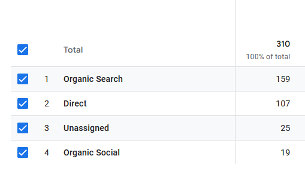

import CallToAction from '../../components/widgets/CallToAction.astro'
import SingleTestimonial from '../../components/widgets/SingleTestimonial.astro'
import Stats from '../../components/widgets/Stats.astro'
import Image from '../../components/common/Image.astro';
import Button from '../../components/ui/Button.astro';

{/* Sections
- Client Overview
- The Challenge
- Project Overview
- Key Features
- 
- Testimonial
- Final Thought

TODO:
- Add link to website
- Describe web structure and what we built it with 

*/}

## Client Overview

**Legacy Exteriors Inc** is a Windsor, Ontario-based landscaping company specializing in high-quality home services, including sod installation, driveway services, drainage solutions, and trenching. Founded in 2022 by Alex Orton, a skilled and dedicated handyman, the company has quickly gained a reputation for excellence within the local community. Alex’s commitment to craftsmanship and customer satisfaction has earned him glowing reviews and a loyal client base.

Initially, Legacy Exteriors operated with a basic Wix website—a practical solution for businesses in their early stages. However, as the company grew, the limitations of a DIY platform became apparent. To support their expansion and establish a stronger online presence, Legacy Exteriors sought a professional partner to elevate their digital strategy. That’s where **RVB Data Sciences Corp** stepped in.

<Button 
  variant='link' 
  href="https://legacyexteriorsinc.com"
>
  Visit the website
</Button>

## Project Overview
Legacy Exteriors approached RVB Data Sciences Corp with a clear goal: to modernize and expand their digital footprint. While they had an existing website and a Google Business profile, these assets lacked the structure and optimization needed to drive meaningful results. To address this, we developed a comprehensive plan that included:

- **A newly designed website** to serve as the foundation for their online presence.
- **Search Engine Optimization (SEO)** to improve visibility in local search results.
- **A blog hub** to share valuable content and engage their audience.
- **A Google Ads campaign** to target the local Windsor market.
- **Optimization of their Google Business profile** to enhance credibility and local search performance.

This multi-faceted approach ensured that Legacy Exteriors could attract, engage, and convert potential customers effectively.

## **Services Provided**
To achieve their goals, we provided the following services:

- [Web Development Services](/web-development): A custom-designed website built for scalability and performance.
- [SEO Services](/search-engine-optimization): Ongoing optimization to improve search engine rankings and drive organic traffic.
- [Google Services (Ads, MyBusiness)](/google-business-management): Management of Google Ads campaigns and optimization of their Google Business profile.
- [Web Hosting Solutions](/web-hosting): Secure, reliable hosting with a 99.9% uptime guarantee.

## **Key Features Implemented**
One of the standout features requested by Legacy Exteriors was the addition of a **blog hub**. Blogs are a powerful tool for businesses to share expertise, engage their audience, and improve SEO. We designed a fully customizable and scalable blogging platform using WordPress that allows Legacy Exteriors to:

- Publish consistent, high-quality content.
- Target specific keywords to boost search engine visibility.
- Share posts across social media and other platforms to drive traffic.

**WordPress CMS**:
- The website was built using WordPress, a powerful and flexible content management system (CMS) that allows Legacy Exteriors to easily update and manage their content.
- WordPress’s user-friendly interface ensures that even non-technical users can make updates effortlessly.

**Search Engine Optimization (SEO)**:
- We implemented a comprehensive local SEO strategy to improve Legacy Exteriors’ visibility in Windsor and surrounding areas.
- This included optimizing website content with location-based keywords, improving site structure, and building backlinks from reputable directories.

**Google Business Profile Optimization**:
- We optimized Legacy Exteriors’ Google Business Profile to ensure they appear in local searches and have updated information.

## **Results and Metrics**
The collaboration with Legacy Exteriors Inc delivered measurable results across multiple channels. Below is a summary of the outcomes:

### SEO
### Overview:
SEO efforts began during the website development phase and focused on optimizing content, improving site structure, and targeting local keywords. While SEO is a long-term strategy, initial improvements in search rankings and organic traffic were observed within six months.

### Key Metrics:
- **Organic Traffic Increase**: Organic Traffic makes up a majority of web traffic to Legacy Exteriors.
- **Local Search Visibility**: Improved rankings for key terms like “landscaping services in Windsor.

### Google Ads Campaign
### Overview:
Legacy Exteriors launched a Google Ads campaign to increase brand visibility and generate leads. The campaign targeted local customers searching for landscaping services in Windsor.

### Campaign Details
- **Objective**: Increase brand exposure and drive calls/website inquiries.
- **Budget**: $560/month($18.60/day)
- **Runtime**: 7 Weeks
- **Result**: Success

### Key Metrics
- Average of  234.5% increase in active web users.
- 785.7% spike in users 4 weeks into campaign.

<Stats
 stats={[
      { title: 'Impressions', amount: '35K' },
      { title: 'click through rate', amount: '$3.43' },
      { title: 'direct ad calls', amount: '35' },
    ]}
>
</Stats>

### **Campaign Timeline**

  

    <Image
      src="~/assets/images/clients/legacy-exteriors/legacy-exteriors-portfolio-google-ads-campaign-start.png"
      alt="SEO Dashboard"
      class="w-full h-auto !m-0 rounded-md"
    />
  

  

    <Image
      src="~/assets/images/clients/legacy-exteriors/legacy-exteriors-portfolio-google-ads-campaign-spike1.png"
      alt="Google Ads Campaign"
      class="w-full h-auto !m-0 rounded-md"
    />
  

  

    <Image
      src="~/assets/images/clients/legacy-exteriors/legacy-exteriors-portfolio-google-ads-campaign-spike2.png"
      alt="Website Analytics"
      class="w-full h-auto !m-0 rounded-md"
    />
  

The Google Ads campaign began with a steady start, quickly gaining traction as traffic surged to the website. During this initial phase, Legacy Exteriors started receiving calls directly from the ads and their website, marking a promising beginning. However, after the initial surge, we noticed a period of stagnation. By adjusting the campaign strategy, we achieved another significant increase in traffic. This second wave of success was so impactful that Legacy Exteriors decided to **end the campaign early**—they were fully booked and ready to focus on delivering exceptional service to their new clients.

## **Client Testimonial**
Working with Legacy Exteriors Inc was a rewarding experience. Alex Orton, the owner, shared his feedback on our collaboration:

<SingleTestimonial
  testimonials={[
    {
      testimonial: `Great service. Working on improving SEO constantly. Easy to get a hold of and replies usually within hours. Changes are made the same day. We both continue to adjust the website if we notice where improvements can be made.`,
      name: 'Alex Orton',
      job: "Legacy Exteriors Inc - Owner"
    },
  ]}
/>

## **Final Thought**
At RVB Data Sciences Corp, we pride ourselves on delivering tailored solutions that drive real results. Legacy Exteriors Inc is a testament to how a strategic approach to web development, SEO, and digital marketing can transform a business’s online presence. Whether you’re a small business looking to grow or an established company seeking to optimize your digital strategy, we’re here to help.

<CallToAction
    actions={[
        {
            text: 'Contact Us',
            href: '/contact#form',
            target: '_self',
            variant: 'primary',
        },
        ]}
    >
        <Fragment slot="title">
          Ready to Transform Your Business?
        </Fragment>

        <Fragment slot="subtitle">
          Let’s build something amazing together. 
          Contact us today to discuss your project and discover how we can help you achieve your goals.
        </Fragment>

  </CallToAction>